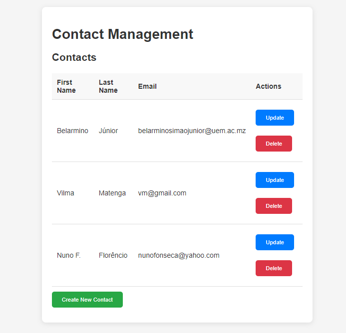
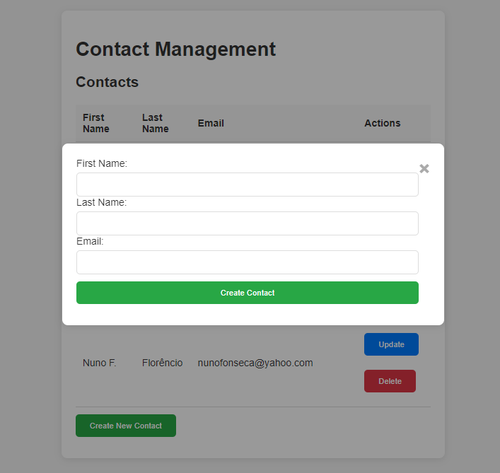
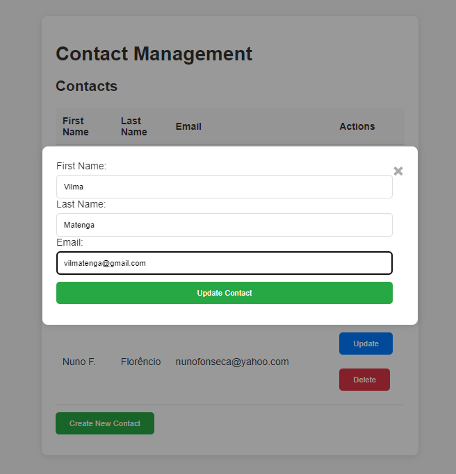

# Flask Fullstack App

A full-stack web application built with Flask and React.js for managing contacts.

## Features

- Create, update, and delete contacts.
- Modern and minimalist UI design.
- Responsive layout.

## Technologies Used

- **Backend**: Flask
- **Frontend**: React.js
- **Styling**: CSS

## Setup

1. **Clone the repository**:

   ```bash
   git clone https://github.com/your-username/flask-fullstack-app.git
   cd flask-fullstack-app
   ```

2. **Backend setup**:

   ```bash
   cd backend
   python -m venv venv
   source venv/bin/activate  # On Windows use `venv\Scripts\activate`
   pip install -r requirements.txt
   python main.py
   ```

3. **Frontend setup**:
   ```bash
   cd frontend
   npm install
   npm run dev
   ```

## Demo

### Home Page



### Create Contact



### Update Contact



## License

This project is licensed under the [MIT License](./LICENSE).
